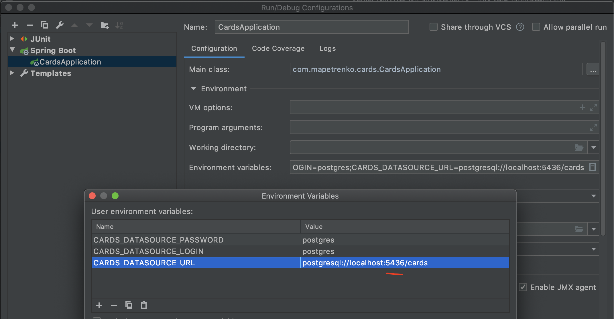

# Cards API

## Docker Compose configurations

### Run Cards Server with DB
```
docker-compose up
```
or
```
docker-compose -f docker-compose.yml up
```
### Run Only DB (for backend dev purposes)
Start db container (exposes port: **5436**)
```
docker-compose -f docker-compose-db.yml up
```

Than please configure proper environment variables in Run/Debug configurations for Card Server
```
CARDS_DATASOURCE_URL=postgresql://localhost:5436/cards
CARDS_DATASOURCE_PASSWORD=postgres
CARDS_DATASOURCE_LOGIN=postgres
```  


## Learning
### Get random card
```
GET /api/v1/learn/card
```

### Acknowledge
```
POST /api/v1/learn/aknowledge/{cardsId}
```

## Get Cards
```
GET /api/v1/cards
```

## Card CRUD
### Create
```
POST /api/v1/cards/
{
  "querstion": "...",
  "answer": "..."
}
```

### Read
```
GET /api/v1/cards/{cardId}
```

### Edit
```
POST /api/v1/cards/{cardId}
{
  "querstion": "...",
  "answer": "..."
}
```

### Delete
```
DELETE /api/v1/cards/{cardId}
```
